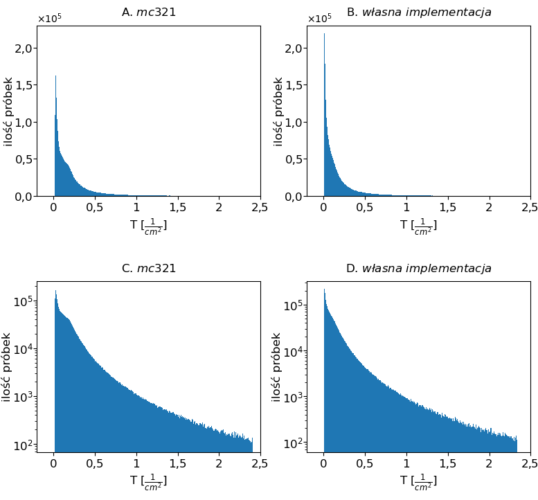

#### Powiązane projekty
- [monte-carlo-sim-python](https://github.com/Mateuszq28/monte-carlo-sim-python) - symulacja światła, moduł wizualizacji ścieżki fotonów w 3D (za pomocą Vispy)
- [monte-carlo-sim-benchmark](https://github.com/Mateuszq28/monte-carlo-sim-benchmark) - dostosowane symulacje przykładowe z literatury (tiny, small, mc321), zapis do jednolitego formatu "CUBES.json", przetwarzanie końcowe i normalizacja, generowanie tabel porównawczych, wykresy, mapy ciepła, wizualizacje 3D ortogonalnych map ciepła
- [monte-carlo-sim-tables](https://github.com/Mateuszq28/monte-carlo-sim-tables) - tabele ze statystykami rozkładów transportu fotonów dla przeprowadzonych eksperymentów
- [CUBES](https://1drv.ms/f/c/7871da7edeb06dcc/Ei70d6guE4lBgMsf6FgGbJsBUcYmqrgZFZZxBHvQeMgqBQ) - wyniki najważniejszych eksperymentów zapisane w ujednoliconym formacie CUBE.json

## Podsumowanie

Repozytorium służy do porównania wyników własnej implementacji symulacji światła [monte-carlo-sim-python](https://github.com/Mateuszq28/monte-carlo-sim-python) z przykładami z literatury. W folderach umieszczono kilka odmian symulacji. Najważniejszą stanowi **mc456_mc.c**. Jest to zmodyfikowana do własnych potrzeb wersja *mc321.c*. Modyfikacja zmienia parametry ośrodka symulacji i dodaje zapis wyników do identycznej struktury, jak w przypadku własnej implementacji - prostopadłościanu w pliku w formacie json.\
\
Kolejnym ważnym folderem jest [mati_sim_transform](mati_sim_transform). W środku znajduje się krótki interaktywny notatnik przekształcający dane wyjściowe własnej symulacji do porządanego, ujednoliconego formatu.\
\
Ostatecznie najważniejszy jest interaktywny notatnik [compare_cubes/compare.ipynb](compare_cubes/compare.ipynb) służący do porównywania ze sobą wynikowych prostopadłościanów z różnych symulacji.\
\
W drugiej wersji notatnika - [compare_cubes/compare2.ipynb](compare_cubes/compare2.ipynb) - umieszczono systematyczne porównywanie wielu eksperymentów. Tworzony jest obiekt wejściowy klasy eksperyment, w którym sprecyzowano ścieżki folederów z danymi oraz wzorce do porównywania. \
\
Pliki wynikowe (tylko najważniejsze) z końcówką *_cubes.json* umieszczono w chmurze ze względu na duży rozmiar plików.
[Link do plików json z wynikami symulacji](https://1drv.ms/f/c/7871da7edeb06dcc/Ei70d6guE4lBgMsf6FgGbJsBUcYmqrgZFZZxBHvQeMgqBQ)

- oryginalne parametry - oryginalne paremetry środowiska symulacji z implementacji z literatury
- własne parametry - parametry wybrane na podstawie przeglądu literatury pod kątem optycznych parametrów skóry

### Struktura folderów

- W folderze [original_all](original_all) umieszczono oryginalne kody źródłowe 3 symulacji światła w jednolitym ośrodku.
- W folderze [original_params](original_params) umieszczono kody źródłowe uruchomionych symulacji światła w jednolitym ośrodku z **oryginalnymi** paramerami ośrodoka symulacji. 
- W folderze [benchmark_sims](benchmark_sims) umieszczono kody źródłowe uruchomionych symulacji światła w jednolitym ośrodku z **własnymi** paramerami ośrdoka symulacji.

### Zmodyfikowane wersje mc321.c
- [mc456_mc.c](benchmark_sims/mc456_mc.c) - dodaje zapis prostopadłościanu, zmienia źródło światła na takie samo jak we własnej implementacji [0,0,-1], nie ingeruje w algorytm (np. nie wymusza zakończenia symulowania fotonu po przekroczeniu umownej granicy).
- [mc456_p.py](benchmark_sims/mc456_p.py) - to samo co wyżej, tylko przetłumaczona na język python.

### Wrappery
- [time_wrapper.py](time_wrapper.py) - ułatwia zapis logów z symulacji (wersja dla programów kompilowanych c)
- [time_wrapper_p.py](time_wrapper_p.py) - ułatwia zapis logów z symulacji (wersja dla programów python)

### Kompilowanie programów

Przykładowo, przy użyciu Visual Studio 2022 wystarczy uruchomić konsolę deweloperską:\
*developer Command Prompt for VS 2022*\
Następnie po otworzeniu w konsoli folderu z kodem źródłowym należy wpisać:

```
cl mc456_mc.c
```

Powyższa komenda utworzy plik wykonywalny *exe*.

## Porównanie czasu symulacji

<ins>monte-carlo-python</ins>\
[repozytorium github](https://github.com/Mateuszq28/monte-carlo-sim-python)\
*język programowania: python*\
jednolita tkanka\
Moja implementacja (monte-carlo-sim-python): 3895 sekund (1h 5 min) dla 1 mln fotonów\
Po zoptymalizowaniu liczenia sinusów i cosinusów 1mln fotonów: 1784 sekund (30 min)

<ins>tiny_mc.c</ins>
[[5]](#5)\
*język programowania: c*\
oryginalne parametry 10 000 fotonów: 3.44 sekundy\
oryginalne parametry 100 000 fotonów: 22.96 sekund\
oryginalne parametry 1 mln fotonów: 227.51 sekund (3 min 47s)\
oryginalne parametry 10 mln fotonów: 2257.98 sekund (37 min 38s)\
oryginalne parametry 100 mln fotonów: 23994.01 sekund (6h 40 min)\
własne parametry 10 000 fotonów: 1.97 sekundy\
własne parametry 100 000 fotonów: 9.06 sekund\
własne parametry 1 mln fotonów: 78.93 sekund (1 min 19s)\
własne parametry 10 mln fotonów: 787.23 sekund (13 min 7s)\
własne parametry 100 mln fotonów: 7939.78 sekund (2h 12 min)

<ins>small_mc.c</ins>
[[5]](#5)\
*język programowania: c*\
oryginalne parametry 10 000 fotonów: 2.66 sekundy\
oryginalne parametry 100 000 fotonów: 22.96 sekund\
oryginalne parametry 1 mln fotonów: 227.51 sekund (3 min 48 s)\
oryginalne parametry 10 mln fotonów: 2257.98 sekund (37 min 38 s)\
oryginalne parametry 100 mln fotonów: 23994.01 sekund (6h 40 min)\
własne parametry on small 10 000 fotonów: 1.92 sekundy\
własne parametry small 100 000 fotonów: 7.76 sekund\
własne parametry small 1 mln fotonów: 65.39 sekund (1 min 5 s)\
własne parametry small 10 mln fotonów: 649.34 sekund (10 min 49 s)\
własne parametry small 100 mln fotonów: 7699.98 sekund (2h 8 min)

<ins>mc321_mc.c</ins>
[[5]](#5)\
*język programowania: c*\
oryginalne parametry 10 000 fotonów: 0.6 sekund\
oryginalne parametry 1 mln fotonów: 1.2 sekund\
własne parametry 10 000 fotonów: 1.6 sekund\
własne parametry 1 mln fotonów: 135 sekund

<ins>mc321_p.py</ins>
[[5]](#5)\
*język programowania: python*\
oryginalne parametry 10 000 fotonów: 0.2 sekund\
oryginalne parametry 1 mln fotonów: 9.8 sekund\
własne parametry 10 000 fotonów: 35.8 sekund\
własne parametry 1 mln fotonów: 3910 sekund (1h 5 min)

<ins>mc456_p.py</ins>
[[5]](#5)\
*język programowania: python*\
oryginalne parametry 10 000 fotonów: 11 sekund\
oryginalne parametry 1 mln fotonów: 19 sekund\
własne parametry 10 000 fotonów: 55 sekund\
własne parametry 1 mln fotonów: 4490 sekund (1h 15 min)

<ins>mc456_mc.c</ins>
[[5]](#5)\
*język programowania: python*\
oryginalne parametry 10^4 = 10 000 fotonów: 11.14 sekund\
oryginalne parametry 10^5 = 100 000 fotonów: 21.53 sekund\
oryginalne parametry 10^6 = 1 mln fotonów: 117.16 sekund (1 min 57 s)\
oryginalne parametry 10^7 = 10 mln fotonów: 1073.31 sekund (17 min 53 s)\
oryginalne parametry 10^8 = 100 mln fotonów: 10559.07 sekund (2h 56 min)\
własne parametry 10^4 = 10 000 fotonów: 10.66 sekund\
własne parametry 10^5 = 100 000 fotonów: 16.05 sekund\
własne parametry 10^6 = 1 mln fotonów: 53.89 sekund\
własne parametry 10^7 = 10 mln fotonów: 410.25 sekund (6 min 50 s)\
własne parametry 10^8 = 100 mln fotonów: 3864.15 sekund (1h 4 min)


<!--
overflow and too less digits in print e notation
<ins>mc456_mc.c</ins>
*programming language: python*
original parameters 10^4 = 10 000 photons: 8.0297 seconds
original parameters 10^5 = 100 000 photons: 7.9869 seconds
original parameters 10^6 = 1 mln photons: 9.4164 seconds
original parameters 10^7 = 10 mln photons: 12.6733 seconds
original parameters 10^8 = 100 mln photons: 36.6226 seconds
original parameters 10^9 = 1 mld photons: 290.9062 seconds (5min)
my parameters on mc456 10^4 = 10 000 photons: 10.5652 seconds
my parameters on mc456 10^5 = 100 000 photons: 23.9545 seconds
my parameters on mc456 10^6 = 1 mln photons: 151.7471 seconds
my parameters on mc456 10^7 = 10 mln photons: 1356.2483 seconds (23 min)
my parameters on mc456 10^8 = 100 mln photons: 13290.7210 seconds (3h 42 min)
-->

## Okres generatora

Okres (lub długość cyklu) generatora bazowego jest definiowany jako maksymalna liczba wartości, które można wygenerować, zanim sekwencja zacznie się powtarzać. [[1]](#1)

#### tiny i small
<ins>okres funkcji rand z biblioteki standardowej języka c</ins>\
*Z dokumentacji:*\
POSIX wymaga, aby okres generatora liczb pseudolosowych używanego przez rand wynosił co najmniej 2^32. [[2]](#2)\
2^32 = 4 294 967 296

#### mc321
Autorzy wykorzystali własny algorytm generatora liczb losowych oparty na dwóch książkach. Niestety, ani na stronie internetowej, ani w artykule, ani w kodzie nie podali informacji o jego okresie. Możemy jednak założyć, że był on znacznie większy niż okres generatora zaimplementowany w funkcji rand ze standardowej biblioteki C.

<ins>Z notatki dołączonej do kodu możemy wyczytać:</ins>

Generator liczb losowych, który generuje równomiernie rozłożone liczby losowe od 0 do 1 włącznie.

Algorytm opiera się na:\
*W.H. Press, S.A. Teukolsky, W.T. Vetterling, and B.P.
Flannery, "Numerical Recipes in C," Cambridge University
Press, 2nd edition, (1992).* [[3]](#3)\
and\
*D.E. Knuth, "Seminumerical Algorithms," 2nd edition, vol. 2
of "The Art of Computer Programming", Addison-Wesley, (1981).* [[4]](#4)

#### monte-carlo-sim-python *(własna implementacja)*
domyślnie używa Permuted Congruential Generator (64-bit, PCG64)\
okres generatora = 2^128 = 3,4E38


## Bibliografia

<a name="1"></a> [1] https://support.nag.com/numeric/mb/nagdoc_mb/manual_25_1/html/g05/g05intro.html#:~:text=The%20period%20(or%20cycle%20length,the%20sequence%20starts%20to%20repeat.

<a name="2"></a> [2] https://devdocs.io/c/numeric/random/rand

<a name="3"></a> [3] *W.H. Press, S.A. Teukolsky, W.T. Vetterling, and B.P.
Flannery, "Numerical Recipes in C," Cambridge University
Press, 2nd edition, (1992).*
https://www.fccdecastro.com.br/CursoC&C++/Numerical%20Recipes%20in%20C%202nd%20-%20%20Press.pdf

<a name="4"></a> [4] *D.E. Knuth, "Seminumerical Algorithms," 2nd edition, vol. 2
of "The Art of Computer Programming", Addison-Wesley, (1981).*
https://seriouscomputerist.atariverse.com/media/pdf/book/Art%20of%20Computer%20Programming%20-%20Volume%202%20(Seminumerical%20Algorithms).pdf

<a name="5"></a> [5] https://omlc.org/software/mc/


<!-- ENGLISH -->
<!-- 
## Time comparison

<ins>monte-carlo-python</ins>
[repo](https://github.com/Mateuszq28/monte-carlo-sim-python)
*programming language: python*
homogeneous tissue
My sim time (monte-carlo-sim-python): 3895.3408 seconds (1h 5 min) for 1 mln photons

<ins>tiny_mc.c</ins>
*programming language: c*
original parameters 10 000 photons: 1.2420 seconds
original parameters 1 mln photons: 16.6361 seconds
my parameters on tiny 10 000 photons: 1.1717 seconds
my parameters on tiny 1 mln photons: 108.9439 seconds

<ins>small_mc.c</ins>
*programming language: c*
original parameters 10 000 photons: 1.1567 seconds
original parameters 100 000 photons: 3.4751 seconds
original parameters 1 mln photons: 26.5167 seconds
my parameters on small 10 000 photons: 1.7543 seconds
my parameters on small 100 000 photons: 8.9404 seconds
my parameters on small 1 mln photons: 86.9339 seconds

<ins>mc321_mc.c</ins>
*programming language: c*
original parameters 10 000 photons: 0.6321 seconds
original parameters 1 mln photons: 1.2259 seconds
my parameters on mc321 10 000 photons: 1.5611 seconds
my parameters on mc321 1 mln photons: 134.7727 seconds

<ins>mc321_p.py</ins>
*programming language: python*
original parameters 10 000 photons: 0.2350 seconds
original parameters 1 mln photons: 9.8403 seconds
my parameters on mc321 10 000 photons: 35.7755 seconds
my parameters on mc321 1 mln photons: 3910.4484 seconds (1h 5 min)

<ins>mc456_p.py</ins>
*programming language: python*
original parameters 10 000 photons: 10.8785 seconds
original parameters 1 mln photons: 19.1455 seconds
my parameters on mc456 10 000 photons: 55.4248 seconds
my parameters on mc456 1 mln photons: 4490.3612 seconds (1h 15 min)

<ins>mc456_mc.c</ins>
*programming language: python*
original parameters 10^4 = 10 000 photons: 11.0115 seconds
original parameters 10^5 = 100 000 photons: 11.3500 seconds
original parameters 10^6 = 1 mln photons: 12.0787 seconds
original parameters 10^7 = 10 mln photons: 14.1013 seconds
original parameters 10^8 = 100 mln photons: 15.6716 seconds
original parameters 10^9 = 1 mld photons: 287.5533 seconds (5 min)
my parameters on mc456 10^4 = 10 000 photons: 12.4692 seconds
my parameters on mc456 10^5 = 100 000 photons: 38.7502 seconds
my parameters on mc456 10^6 = 1 mln photons: 162.7858 seconds (2 min 43 s)
my parameters on mc456 10^7 = 10 mln photons: 1358.7487 seconds (23 min)
my parameters on mc456 10^8 = 100 mln photons: 13275.9499 seconds (3h 42 min)
-->

<!--
overflow and too less digits in print e notation
<ins>mc456_mc.c</ins>
*programming language: python*
original parameters 10^4 = 10 000 photons: 8.0297 seconds
original parameters 10^5 = 100 000 photons: 7.9869 seconds
original parameters 10^6 = 1 mln photons: 9.4164 seconds
original parameters 10^7 = 10 mln photons: 12.6733 seconds
original parameters 10^8 = 100 mln photons: 36.6226 seconds
original parameters 10^9 = 1 mld photons: 290.9062 seconds (5min)
my parameters on mc456 10^4 = 10 000 photons: 10.5652 seconds
my parameters on mc456 10^5 = 100 000 photons: 23.9545 seconds
my parameters on mc456 10^6 = 1 mln photons: 151.7471 seconds
my parameters on mc456 10^7 = 10 mln photons: 1356.2483 seconds (23 min)
my parameters on mc456 10^8 = 100 mln photons: 13290.7210 seconds (3h 42 min)
-->

<!-- ## Generator period

The period (or cycle length) of a base generator is defined as the maximum number of values that can be generated before the sequence starts to repeat. [[1]](#1)

#### tiny and small
<ins>c stdlib rand function perioid</ins>
*From documentation:*
POSIX requires that the period of the pseudo-random number generator used by rand be at least 2^32. [[2]](#2)
2^32 = 4 294 967 296

#### mc321
The authors used their own random number generator algorithm based on two books. Unfortunately, neither on the website, nor in the paper, nor in the code did they provide information on its period. However, we can assume that it was significantly larger than the generator period implemented in the rand function from the standard C library.

<ins>From the note included in the code, we can read:</ins>

A random number generator that generates uniformly
distributed random numbers between 0 and 1 inclusive.

The algorithm is based on:
*W.H. Press, S.A. Teukolsky, W.T. Vetterling, and B.P.
Flannery, "Numerical Recipes in C," Cambridge University
Press, 2nd edition, (1992).* [[3]](#3)
and
*D.E. Knuth, "Seminumerical Algorithms," 2nd edition, vol. 2
of "The Art of Computer Programming", Addison-Wesley, (1981).* [[4]](#4)

#### monte-carlo-sim-python *(my implementation)*
by default it uses Permuted Congruential Generator (64-bit, PCG64)
generator period = 2^128 = 3,4E38


## Bibliography

<a name="1"></a>[1] https://support.nag.com/numeric/mb/nagdoc_mb/manual_25_1/html/g05/g05intro.html#:~:text=The%20period%20(or%20cycle%20length,the%20sequence%20starts%20to%20repeat.

<a name="2"></a>[2] https://devdocs.io/c/numeric/random/rand

<a name="3"></a> [3] *W.H. Press, S.A. Teukolsky, W.T. Vetterling, and B.P.
Flannery, "Numerical Recipes in C," Cambridge University
Press, 2nd edition, (1992).*
https://www.fccdecastro.com.br/CursoC&C++/Numerical%20Recipes%20in%20C%202nd%20-%20%20Press.pdf

<a name="4"></a> [4] *D.E. Knuth, "Seminumerical Algorithms," 2nd edition, vol. 2
of "The Art of Computer Programming", Addison-Wesley, (1981).*
https://seriouscomputerist.atariverse.com/media/pdf/book/Art%20of%20Computer%20Programming%20-%20Volume%202%20(Seminumerical%20Algorithms).pdf
 -->


 ## Galeria / Gallery

<p align="center"><br/>
<i>Mapy ciepła przekrojów środkowych, 100 mln - 100 tys. fotonów</i><br/>
<i>Heat maps of mid-sections, 100 million - 100 thousand photons</i></p><br/>

<p align="center"><br/>
<i>Mapy ciepła średnich wartości, 100 mln - 100 tys. fotonów</i><br/>
<i>Heatmaps of average values, 100 million - 100 thousand photons</i></p><br/>

<p align="center"><br/>
<i>Mapy ciepła, na górze własne parametry, na dole z mc321</i><br/>
<i>Heatmaps, own parameters on top, from mc321 on bottom</i></p><br/>

<p align="center"><br/>
<i>Histogramy rozkładu wartości fluencji względnej fotonów</i><br/>
<i>Histograms of the distribution of relative photon fluence values</i></p><br/>

<p align="center"><br/>
<i>Współczynnik anizotropii 0, 0,5, 0,9</i><br/>
<i>Anisotropy coefficient 0, 0.5, 0.9</i></p><br/>

<p align="center"><br/>
<i>Zmiana współczynnika fluencji względnej w głąb ośrodka</i><br/>
<i>Change of relative fluence coefficient in depth of the medium</i></p><br/>

<p align="center"><br/>
<i>Zmiana współczynnika fluencji względnej w poprzek ośrodka</i><br/>
<i>Change in relative fluence coefficient across the medium</i></p><br/>

<p align="center"><br/>
<i>5 źródeł światła</i><br/>
<i>5 light sources</i></p><br/>

<p align="center"><br/>
<i>Model dwuwarstwowy skóry</i><br/>
<i>Two-layer skin model</i></p><br/>

<p align="center"><br/>
<i>Model trzywarstwowy skóry</i><br/>
<i>Three-layer skin model</i></p><br/>

<p align="center"><br/>
<i>Model skóry z żyłą</i><br/>
<i>Skin model with vein</i></p><br/>